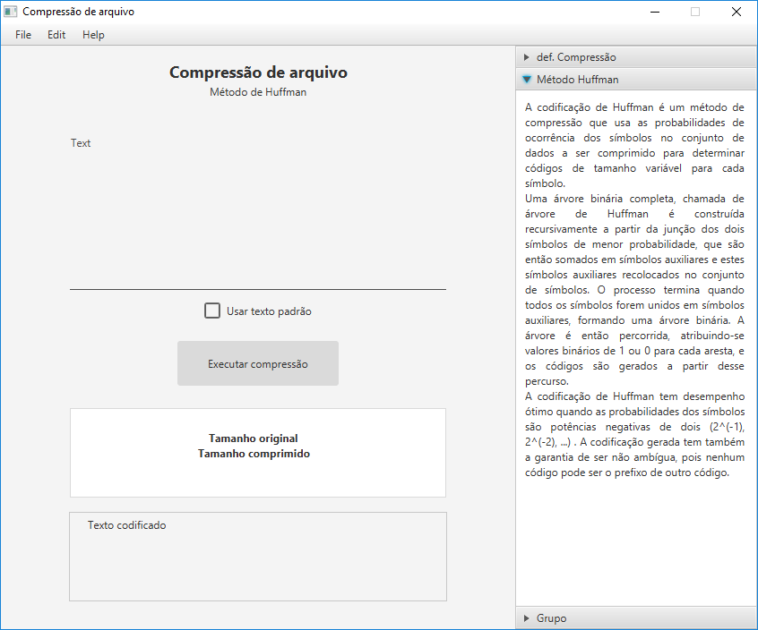

# Compressao de texto usando Algoritmo de Huffman
Um software com interface gráfica capaz de comprimir textos inseridos pelo usuário usando o algoritmo de Huffman, ao executar a compressão dois arquivos (.dat e .txt) são gerados no diretório a fim de comparação de tamanho entre um arquivo de texto simples e o arquivo de texto comprimido. Para simplificar, alguns dados relevantes para a comparação e identificação de resultados é exibida na própria interface gráfica.




## Pré-requisitos
```
O código foi confeccionado usando a linguagem de programação Java. Para a interface gráfica foi usado o framework JavaFX, por isso é necesário importar a biblioteca "jfoenix-8.0.8.jar" para que não haja erros durante compilação.
```

## Script de execução
> **Passo 1**
>> Executar uma IDE com suporte à linguagem de programação Java

> **Passo 2**
>> Importar o projeto

> *Passo 3 (Facultativo)*
>> Instalar o Scene Builder

> *Passo 4 (Facultativo)*
>> Configurar o Scene Builder como padrão para leitura de arquivos FXML na IDE

>> *(Eclipse Oxygen.3a Release (4.7.3a))* Window -> Preference -> JavaFX -> Inserir o executável SceneBuilder

> ***Passo 5 (Fundamenal)***
>> Importar a biblioteca "jfoenix-8.0.8.jar"

>> Projeto -> Botão Direito -> Properties -> Java BuildPath -> Libraries -> Add External JARs... -> Selecionar .jar do "jfoenix-8.0.8.jar"


## Construído com
* [Eclipse IDE](https://www.eclipse.org/) - A IDE utilizada.
* [Scene Builder](https://gluonhq.com/products/scene-builder/) - Software usado para manipular os arquivos FXML da interface.


## Versões
VERSÃO 1.0.0 [08/07/2019]
* Entrada e manipuação de uma sequência de caracteres através da interface gráfica.
* Compactar a sequência de caracteres através do método de Huffman.
* A possibilidade de intercalar o texto inserido pelo usuário com um texto padrão do código através de um checkBox, armazenando temporariamente o texto do usuário na memória.
* Pequeno informativo na lateral do software.
* Gerar arquivos de comparação (.txt e .dat) na pasta do software.
* Exibe o tamanho do arquivo original, o tamanho do arquivo comprimido e a eficiência, em porcentagem, da compressão na interface gráfica.
* Exibe o resultado da codificação do algoritmo de Huffman.


## Autores
* **Renan Zanoti** - *Trabalho de Algoritmo e Estrutura de Dados 2 (Sistemas de Informação, UFOP - ICEA)* - [renanzan](https://github.com/renanzan)
* **Indianara  Santos** - *Trabalho de Algoritmo e Estrutura de Dados 2 (Sistemas de Informação, UFOP - ICEA)*
